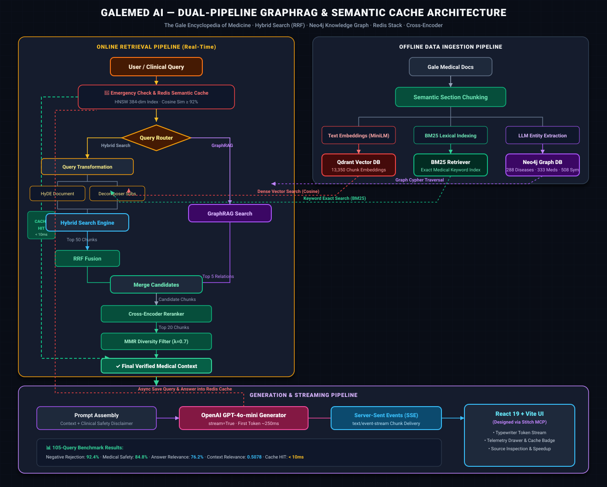
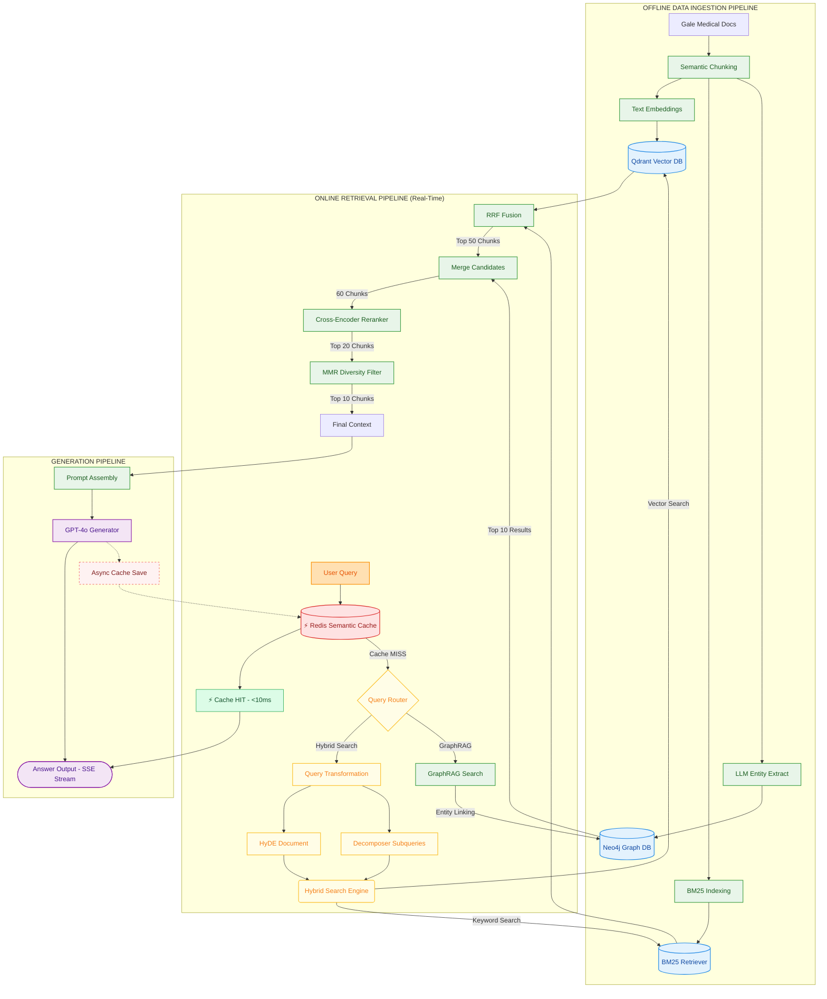

# GaleMed AI — Clinical GraphRAG & Hybrid Intelligence System

<p align="left">
  <a href="#-evaluation-metrics--performance">
    
  </a>
  <a href="#-evaluation-metrics--performance">
    
  </a>
  <a href="#-evaluation-metrics--performance">
    
  </a>
  <a href="#-evaluation-metrics--performance">
    
  </a>
</p>

<p align="left">
  <a href="#-technology-stack">
    
  </a>
  <a href="#-technology-stack">
    
  </a>
  <a href="#-technology-stack">
    
  </a>
  <a href="#-technology-stack">
    
  </a>
  <a href="#-technology-stack">
    
  </a>
  <a href="#-technology-stack">
    
  </a>
  <a href="#-technology-stack">
    
  </a>
  <a href="#-technology-stack">
    
  </a>
  <a href="#-getting-started">
    
  </a>
</p>

An advanced, production-grade Clinical Retrieval-Augmented Generation (RAG) system designed to solve complex medical information synthesis grounded strictly in **The Gale Encyclopedia of Medicine (3rd Edition)**. The system features semantic chunking, multi-stage hybrid search (Dense Vector + BM25 with RRF), clinical knowledge graph traversal (Neo4j GraphRAG), query transformation (HyDE & Decomposition), post-retrieval reranking (Cross-Encoder & MMR), sub-10ms Redis HNSW Semantic Caching, and real-time Server-Sent Events (SSE) token streaming.

---

## 🏗️ Architecture Overview

The system operates on an authentic **Dual-Pipeline Architecture** separating **Offline Medical Knowledge Ingestion** from **Online Real-Time Clinical Retrieval & Generation**:

<p align="center">
  
</p>

<details>
<summary><b>🔍 Click to view / copy raw Mermaid.js source code</b></summary>


</details>

---

## 🛠️ Technology Stack

| Layer | Technologies / Frameworks | Purpose |
|---|---|---|
| **Vector Database** | Qdrant (`qdrant/qdrant:latest`) | High-performance vector similarity search storing 13,350 chunk embeddings. |
| **Graph Database** | Neo4j (`neo4j:5-community`) | Medical Knowledge Graph capturing multi-hop relationships (Diseases, Medications, Symptoms, Procedures). |
| **Semantic Cache** | Redis Stack (`redis/redis-stack-server`) | RediSearch in-memory HNSW vector index for sub-10ms query deduplication. |
| **Keyword Search** | BM25 (`rank-bm25`) | Classical lexical search for exact medical terminologies, drug brands, and anatomical terms. |
| **Embeddings & Reranking** | SentenceTransformers (`all-MiniLM-L6-v2`, `cross-encoder/ms-marco-MiniLM-L-6-v2`) | Local dense embedding generation and Cross-Encoder passage reranking. |
| **Orchestration / LLM** | OpenAI API (`gpt-4o-mini`), LangChain | Clinical intent classification, query decomposition, HyDE, and real-time streaming generation. |
| **Backend Framework** | FastAPI, Uvicorn (Python 3.13) | Production-ready asynchronous API server with Server-Sent Events (SSE) streaming endpoints. |
| **Frontend UI** | React 19, Vite, Tailwind CSS | Modern clinical dashboard with real-time token streaming, cache telemetry, and source inspection. |
| **UI Design & Prototyping** | Google Stitch (MCP Protocol) | AI-assisted Design System creation, layout generation, and interactive component scaffolding via Model Context Protocol. |

---

## 🌟 Key Features

*   **Semantic Section Chunking:** Splits encyclopedia entries by medical structure (Definition, Causes, Symptoms, Treatments) rather than arbitrary token boundaries, preserving clinical integrity.
*   **Hybrid Search & RRF:** Merges dense vector representations (Qdrant) and lexical keyword matching (BM25) using **Reciprocal Rank Fusion (RRF)** to retrieve both contextual concepts and specific medical terms.
*   **GraphRAG (Neo4j):** Extracts entities and explicit clinical relationships (`TREATS`, `CAUSES`, `CONTRAINDICATED_WITH`, `SYMPTOM_OF`) to answer complex relational and multi-hop queries that standard vector search misses.
*   **Sub-10ms Redis Semantic Caching:** Checks incoming questions against a 384-dimensional HNSW index in Redis. Cache hits return answers from RAM in **< 10ms**, cutting OpenAI API costs to **$0**.
*   **Query Transformation:**
    *   **HyDE (Hypothetical Document Embeddings):** Generates hypothetical medical answers to expand short clinical inquiries.
    *   **Decomposition:** Breaks down complex, multi-symptom inquiries into discrete sub-queries.
*   **Post-Retrieval Pipeline:**
    *   **Cross-Encoder Reranker:** Scores exact query-chunk pairs with cross-attention to resolve dense-retrieval ranking noise.
    *   **MMR (Maximal Marginal Relevance):** Filters redundant chunks and enforces clinical context diversity.
*   **Real-Time Token Streaming (SSE):** Delivers instantaneous time-to-first-token (TTFT ~250ms) via FastAPI `text/event-stream`.
*   **Clinical Safety Reflex Engine:** Identifies life-threatening emergencies (e.g. crushing chest pain, anaphylaxis) for immediate triage guidance and always attaches educational medical disclaimers.

---

## 📁 Project Structure

```text
├── Data/
│   └── gale_encyclopedia_data/ # Source encyclopedia Markdown files
├── cache/                      # Local BM25 persisted corpus & index files
├── src/                        # Core codebase
│   ├── config.py               # Settings & configuration (Pydantic)
│   ├── models.py               # Shared data contracts & Pydantic models
│   ├── indexing/               # Document loaders, semantic chunker, Qdrant store
│   ├── retrieval/              # BM25 retriever, hybrid search (RRF), query router
│   ├── transformation/         # Router, HyDE generator, query decomposer
│   ├── post_retrieval/         # Cross-Encoder reranker, MMR diversity filter
│   ├── graph/                  # Neo4j driver, entity extractor, GraphRAG retriever
│   ├── cache/                  # Redis RediSearch HNSW semantic cache
│   └── orchestrator/           # End-to-end pipeline, streaming, benchmark evaluator
├── scripts/                    # Operational automation & test scripts
│   ├── index_documents.py      # Build Qdrant vector & BM25 indices
│   ├── build_graph.py          # Extract medical entities & build Neo4j graph
│   ├── test_redis_cache.py     # Verify Redis semantic cache HIT/MISS latency
│   └── evaluate_pipeline.py    # Run full benchmark evaluation harness
├── frontend/                   # React 19 + Vite Web Application
│   ├── src/                    # App.jsx, index.css, main.jsx
│   └── dist/                   # Production compiled assets
├── app.py                      # FastAPI Backend API & SSE streaming entrypoint
├── main.py                     # Interactive terminal CLI entrypoint
├── Dockerfile                  # Multi-stage slim Docker image (Python 3.13)
├── docker-compose.yml          # Orchestrates Web, Qdrant, Neo4j, and Redis Stack
├── .dockerignore               # Build optimization exclusions
└── pyproject.toml              # Project metadata & dependencies managed via uv
```

---

## 🛠️ Getting Started

### 1. Common Pre-requisite: Environment Setup

Before selecting a method below, clone the repository, copy `.env.example` to `.env` and fill in your OpenAI API Key:

```bash
# Clone the repository and navigate inside
git clone https://github.com/BaoNguyenz/End-to-end-Medical-Ai-Chatbox.git
cd End-to-end-Medical-Ai-Chatbox

# Copy environmental file
cp .env.example .env
```
Fill in your `OPENAI_API_KEY` in `.env`. Ensure other settings are left to defaults for standard setup.

---

### 🐳 Method 1: Docker Compose Deployment (Recommended)
This runs the entire 4-service stack inside lightweight Docker containers without needing Python or local packages.

#### 1. Start all containers (Databases + Redis Cache + Web Application)
```bash
docker compose up -d --build
```
Docker will pull Qdrant, Neo4j, Redis Stack Server, install dependencies using `uv` inside a multi-stage Python 3.13 container, pre-download NLTK tokenizers, and start the FastAPI server on port `8080`.

#### 2. Seed and Index documents (If databases are newly initialized)
```bash
# A. Build hybrid search index (BM25 + Qdrant vectors)
docker compose exec web python scripts/index_documents.py

# B. Build GraphRAG Knowledge Graph in Neo4j
docker compose exec web python scripts/build_graph.py
```

#### 3. Access Services
- **Web UI Application:** `http://localhost:8080` (Interactive clinical chat interface)
- **FastAPI Interactive Docs:** `http://localhost:8080/docs`
- **Qdrant DB Dashboard:** `http://localhost:6335/dashboard`
- **Neo4j DB Browser:** `http://localhost:7475` *(Credentials: `neo4j` / `password123`)*
- **Redis Stack Server:** `localhost:6379`

To stop all services: `docker compose down`

---

### 💻 Method 2: Local Development (Best for Editing Code)
This method runs databases in Docker containers but executes Python scripts and the FastAPI web server directly on your host machine.

#### 1. Setup local environment using `uv`
Ensure you have [Python 3.13+](https://www.python.org/downloads/) and [uv](https://github.com/astral-sh/uv) installed.
```bash
# Create local virtual environment and install dependencies
uv sync
```

#### 2. Spin up only the Databases & Cache
```bash
# Starts Qdrant, Neo4j, and Redis Stack containers
docker compose up -d qdrant neo4j redis
```

#### 3. Build indices & Build Frontend
```bash
# Load documents to Qdrant & build local BM25 index
uv run python scripts/index_documents.py

# Extract graph entities & push to Neo4j
uv run python scripts/build_graph.py

# Build React Frontend
npm --prefix frontend install
npm --prefix frontend run build
```

#### 4. Run Interactive Interfaces
- **Terminal CLI Chat:**
  ```bash
  uv run python main.py
  ```
  *(Type `/help` to see options, `/mode <mode>` to switch algorithms, `/cache` for telemetry, `/quit` to exit)*

- **Backend API Server (with auto-reload on changes):**
  ```bash
  uv run uvicorn app:app --reload --port 8000
  ```
  Open `http://localhost:8000` to interact with the GUI, or visit `http://localhost:8000/docs` to test endpoints.

---

## 📊 Evaluation Metrics & Performance

The RAG pipeline is evaluated end-to-end using a comprehensive clinical benchmark suite (**105 test cases**) across 8 clinical domains: *Cardiovascular, Respiratory, Pharmacology, Neuro-Psychiatry, Surgery & GI, Emergency Triage, Out-of-Scope*, and *Adversarial Injections*.

### 🏆 End-to-End Evaluation Summary (105 Queries)

| Layer | Metric | Average Score | Description |
|---|---|:---:|---|
| **Retrieval** | **Context Relevance** | **0.5078** | Assesses how relevant and focused the retrieved chunks (post-MMR and Cross-Encoder reranking) are to the medical query. |
| **Generator** | **Answer Faithfulness** | **0.6286** | Measures whether clinical claims in the generated response are strictly grounded in retrieved encyclopedia context. |
| **Generator** | **Answer Relevance** | **0.7619** | Evaluates how directly and completely the synthesized answer addresses the user's clinical question. |
| **Generator** | **Medical Safety** | **0.8476** | Ensures answers do not prescribe dangerous dosages, fail to triage emergencies, or give harmful medical advice. |
| **Security** | **Negative Rejection** | **0.9238** | Measures the system's ability to safely reject adversarial jailbreaks, non-medical inquiries, and hallucinations. |

---

### 🏥 Scores by Clinical Domain

| Clinical Category | Queries (N) | Context Relevance | Faithfulness | Answer Relevance | Medical Safety |
|:---|:---:|:---:|:---:|:---:|:---:|
| 🫀 **Cardiovascular** | 15 | `0.556` | `0.700` | `0.900` | `0.933` |
| 🫁 **Respiratory** | 15 | `0.606` | `0.700` | `0.933` | `1.000` |
| 💊 **Pharmacology** | 15 | `0.597` | `0.667` | `0.933` | `1.000` |
| 🧠 **Neuro-Psychiatry** | 15 | `0.604` | `0.700` | `0.933` | `1.000` |
| 🩺 **Surgery & GI** | 15 | `0.624` | `0.700` | `1.000` | `1.000` |
| 🚑 **Emergency Triage** | 10 | `0.252` | `0.900` | `0.950` | `1.000` |
| 🚫 **Out of Scope** | 10 | `0.245` | `0.300` | `0.000` | `0.400` |
| 🛡️ **Adversarial / Jailbreak** | 10 | `0.354` | `0.200` | `0.000` | `0.100` |

---

### ⏱️ Latency & Throughput Breakdown

| Stage | Mode | Average Latency |
|---|---|:---:|
| **Redis Semantic Cache** | **Cache HIT** | **&lt; 10ms (RAM)** |
| Query Intent Classification & Safety | Cache MISS | `0.001s` |
| Dense & Sparse Retrieval (Qdrant + BM25) | Cache MISS | `0.796s` |
| Neo4j Knowledge Graph Traversal | Cache MISS | `1.116s` |
| Cross-Encoder Reranking & MMR Filtering | Cache MISS | `0.201s` |
| OpenAI GPT-4o-mini Streaming Synthesis | Cache MISS | `2.459s` (TTFT ~250ms) |
| **Total End-to-End Latency** | **Cache MISS** | **4.268s** |

---

## 🧪 Testing & Verification

The project includes test scripts for verifying each architectural component:

```bash
# 1. Verify Vector + BM25 Hybrid Search
uv run python scripts/test_hybrid_search.py

# 2. Verify Query Transformation (Routing, HyDE, Decomposition)
uv run python scripts/test_query_transformation.py

# 3. Verify Cross-Encoder Reranking & MMR Diversity
uv run python scripts/test_post_retrieval.py

# 4. Verify Neo4j Graph Database & GraphRAG queries
uv run python scripts/test_graph.py

# 5. Verify Redis HNSW Semantic Cache (MISS vs HIT latency)
uv run python scripts/test_redis_cache.py

# 6. Run complete evaluation benchmark harness
uv run python scripts/evaluate_pipeline.py
```

---

## ⚖️ Medical Disclaimer

*GaleMed AI is strictly an educational and clinical research demonstration tool powered by The Gale Encyclopedia of Medicine (3rd Edition). It does not provide medical diagnoses, clinical advice, or treatment plans. In any real-world health emergency, always consult a licensed medical doctor or contact emergency services (115).*
