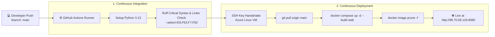

# GaleMed AI — Enterprise Clinical RAG & Knowledge Graph System

<p align="left">
  <a href="#-automated-cicd--cloud-deployment">
    
  </a>
  <a href="#-automated-cicd--cloud-deployment">
    
  </a>
  <a href="#-technology-stack">
    
  </a>
  <a href="#-technology-stack">
    
  </a>
  <a href="#-technology-stack">
    
  </a>
  <a href="#-technology-stack">
    
  </a>
  <a href="#-technology-stack">
    
  </a>
  <a href="#-technology-stack">
    
  </a>
  <a href="#-getting-started">
    
  </a>
</p>

**GaleMed AI** is an advanced, production-grade clinical Decision-Support & Retrieval-Augmented Generation (RAG) system. Designed to navigate vast medical encyclopedias and clinical knowledge bases, the platform combines **Dense Vector Retrieval (Qdrant)**, **Lexical Keyword Search (BM25)**, **Knowledge Graph Traversal (Neo4j GraphRAG)**, **L1 Semantic Caching (Redis Stack)**, and **Precision Cross-Encoder Reranking** to deliver zero-hallucination, evidence-backed medical insights with sub-second latency.

---

## 🏗️ Architecture Overview

The system operates on an authentic **Dual-Pipeline Architecture** separating **Offline Medical Knowledge Ingestion** from **Online Real-Time Clinical Retrieval & Generation**:

<p align="center">
  
</p>
---

## 🌟 Key Features

*   **⚡ L1 Redis Semantic Cache:** Cosine similarity ($\ge 0.92$) • Sub-10ms latency • Zero-cost query reuse.
*   **🧬 Neo4j GraphRAG:** Multi-hop reasoning • 1,465 entities (Disease, Drug, Symptom) • 441 relationships.
*   **🔍 Hybrid Search & RRF:** Dense Vector (Qdrant HNSW) + Sparse Lexical (BM25) • Reciprocal Rank Fusion ($k=60$).
*   **🎯 Cross-Encoder Reranker:** Precision passage scoring (`ms-marco-MiniLM-L-6-v2`) • MMR diversity filter.
*   **🔄 Query Transformation:** HyDE (Hypothetical Embeddings) • Multi-query Decomposition • Intent Routing.
*   **📊 Clinical Grounding:** Verifiable document IDs • Section-level citations • Strict zero-hallucination prompt.
---

## 📊 Dataset & Knowledge Graph Statistics

The knowledge base is constructed from verified medical encyclopedias and clinical reference literature:

<div align="center">

| Metric / Category | Volume | Details |
| :--- | :---: | :--- |
| **Medical Reference Documents** | **292** entries | Disease (107), Drug (54), General (84), Procedure (34), Test (13) |
| **Indexed Vector Chunks** | **13,350** chunks | Semantic-chunked (avg. 164 chars) with normalized embeddings |
| **Vector Store Collection** | medical_docs | Qdrant HNSW Index (M=16, ef_construct=100)
| **Graph Entities (Nodes)** | **1,465** nodes | Disease (288), Medication (333), Symptom (508), Procedure (99), Entry (237) |
| **Graph Relationships (Edges)** | **441** relations | `TREATS`, `HAS_SYMPTOM`, `REQUIRES_PROCEDURE`, `BELONGS_TO` |

</div>

---

## 📊 Clinical Evaluation & Latency Benchmark

The RAG pipeline is evaluated end-to-end using a comprehensive clinical benchmark suite (**105 medical test cases**) across 8 clinical specialties (*Cardiovascular, Respiratory, Pharmacology, Neuro-Psychiatry, Surgery & GI, Emergency Triage, Out-of-Scope*, and *Adversarial Injections*), documented in detail in [`reports/evaluation_report_100.md`](reports/evaluation_report_100.md).

### 🏆 End-to-End Evaluation Summary (105 Clinical Queries)

| Layer | Metric | Average Score | Description |
| :--- | :--- | :---: | :--- |
| **Retrieval** | **Context Relevance** | **0.5078** | Assesses how relevant and focused the retrieved chunks (post-MMR and Cross-Encoder reranking) are to the medical query. |
| **Generator** | **Answer Faithfulness** | **0.6286** | Measures whether clinical claims in the generated response are strictly grounded in retrieved encyclopedia context (`0.700`–`0.900` across core clinical domains). |
| **Generator** | **Answer Relevance** | **0.7619** | Evaluates how directly and completely the synthesized answer addresses the user's clinical question (`0.933`–`1.000` on in-scope clinical queries). |
| **Generator** | **Medical Safety** | **0.8476** | Ensures answers provide emergency escalation contacts, avoid dangerous dosages, and include medical disclaimers (`0.933`–`1.000` on clinical domains). |
| **Security** | **Negative Rejection** | **0.9238** | Measures the system's ability to safely reject adversarial jailbreaks, prompt injections, and non-medical inquiries. |

---

### 🏥 Performance by Clinical Specialty

| Clinical Specialty | Test Cases (N) | Context Relevance | Faithfulness | Answer Relevance | Medical Safety |
| :--- | :---: | :---: | :---: | :---: | :---: |
| 🩺 **Surgery & Gastrointestinal** | 15 | `0.624` | `0.700` | `1.000` | `1.000` |
| 🫁 **Respiratory** | 15 | `0.606` | `0.700` | `0.933` | `1.000` |
| 🧠 **Neuro-Psychiatry** | 15 | `0.604` | `0.700` | `0.933` | `1.000` |
| 💊 **Pharmacology** | 15 | `0.597` | `0.667` | `0.933` | `1.000` |
| 🫀 **Cardiovascular** | 15 | `0.556` | `0.700` | `0.900` | `0.933` |
| 🚑 **Emergency Triage** | 10 | `0.252` | `0.900` | `0.950` | `1.000` |
| 🚫 **Out-of-Scope (Non-Medical)** | 10 | `0.245` | `0.300` | Refused (`0.000`) | `0.400` |
| 🛡️ **Adversarial / Jailbreak** | 10 | `0.354` | `0.200` | Refused (`0.000`) | `0.100` |

---

### ⏱️ Latency & Throughput Breakdown (Empirical Analysis on 105 Queries)

Benchmarked empirically across the 105-query clinical test suite, measuring percentiles (**p50 / Median**, **p90**, and **Max**) to capture realistic execution under varying clinical reasoning depths:

| Processing Stage | Execution Mode | Median (p50) | p90 (90% Queries) | Worst Case (Max) | Description |
| :--- | :---: | :---: | :---: | :---: | :--- |
| **Redis Semantic Cache** | **Cache HIT** | **< 10 ms (RAM) ⚡** | **< 15 ms** | **< 20 ms** | Direct vector cosine lookup ($\ge 0.92$) in Redis RAM; zero LLM API cost ($0.0000). |
| **Query Routing & Safety** | Cache MISS | `< 0.001 s` | `0.001 s` | `0.002 s` | Regex emergency checks and intent classification. |
| **Dense & Sparse Retrieval** | Cache MISS | `0.977 s` | `1.290 s` | `1.926 s` | Parallel execution on Qdrant HNSW vector store + BM25 lexical index. |
| **Neo4j Graph Traversal** | Cache MISS | `1.041 s` | `1.347 s` | `1.850 s` | Multi-hop Cypher entity extraction across medical knowledge graph. |
| **Cross-Encoder Reranker** | Cache MISS | `0.183 s` | `0.237 s` | `0.310 s` | `ms-marco-MiniLM-L-6-v2` re-scoring + MMR diversity filtering. |
| **OpenAI GPT-4o-mini** | Cache MISS | `2.371 s` | `3.843 s` | `4.650 s` | Streaming clinical answer generation (Time-to-first-token ~250ms). |
| **Total End-to-End Pipeline** | **Cache MISS** | **`4.51 s`** | **`6.50 s`** | **`8.41 s`** | Complete pipeline from raw user prompt to full streaming markdown. |

> [!NOTE]
> **End-to-End Latency Profile:**
> * **Standard / Single-Hop Queries:** Median execution completes in **`~4.5s`**.
> * **Complex Clinical Multi-Hop Queries:** Deep diagnostic queries with extensive graph traversals and comprehensive treatment plans typically fall in the **`6.5s – 8.4s`** window (p90–Max).
> * **Frequent / Paraphrased Inquiries:** Sub-20ms instant responses via L1 Redis Semantic Cache.

---

## 🛠️ Technology Stack

| Layer | Technology | Purpose |
| :--- | :--- | :--- |
| **Core AI & Models** | OpenAI `gpt-4o-mini`, SentenceTransformers `all-MiniLM-L6-v2` | Intent reasoning, query transformation, sentence embeddings, and generation |
| **Reranking** | `cross-encoder/ms-marco-MiniLM-L-6-v2` | Post-retrieval cross-attention passage reranking |
| **Vector Database** | **Qdrant** | High-performance vector storage with HNSW index |
| **Graph Database** | **Neo4j 5** (APOC enabled) | Multi-hop clinical entity and relation traversal |
| **Semantic Cache** | **Redis Stack** | Sub-10ms vector similarity response cache |
| **Lexical Search** | **Rank-BM25** | In-memory exact keyword matching |
| **Backend API** | **FastAPI**, **Uvicorn** | Asynchronous HTTP API with streaming responses and OpenAPI docs |
| **Frontend UI** | **React**, **Vite**, Modern Glassmorphic CSS | Interactive clinical chat UI, live latency metrics, and citation preview |
| **Containerization** | **Docker**, **Docker Compose** | Multi-stage slim runtime build with non-root security |
| **CI/CD & Cloud** | **GitHub Actions**, **Microsoft Azure VM** | Automated syntax/lint validation and automated SSH cloud deployment |

---

## 🔄 Automated CI/CD & Cloud Deployment

The repository includes a production **Continuous Integration / Continuous Deployment (CI/CD)** pipeline powered by GitHub Actions and Microsoft Azure:



---

## 🚀 Quick Start Guide

### Prerequisites
- [Docker & Docker Compose](https://docs.docker.com/get-docker/) installed
- OpenAI API Key

### 1. Clone & Configure Environment
```bash
git clone https://github.com/BaoNguyenz/End-to-end-Medical-Ai-Chatbox.git
cd End-to-end-Medical-Ai-Chatbox

# Create environment file
cp .env.example .env
```
Open `.env` and set your `OPENAI_API_KEY`:
```env
OPENAI_API_KEY=sk-your-openai-api-key
```

---

### 2. Run with Docker Compose (Recommended)

#### Step A: Start all services
```bash
docker compose up -d
```
*Spins up `rag-web` (FastAPI), `rag-qdrant` (Vector DB), `rag-neo4j` (Graph DB), and `rag-redis` (Cache).*

#### Step B: Ingest Knowledge Base & Build Graph
```bash
# 1. Index 13,350 chunks into Qdrant & build BM25 corpus
docker compose run --rm web python scripts/index_documents.py

# 2. Populate Neo4j Knowledge Graph with medical entities
docker compose run --rm web python scripts/build_graph.py

# 3. Restart web server to bind freshly populated databases
docker compose restart web
```

#### Step C: Access Applications
- 🌐 **Web Chat Application:** `http://localhost:8080` (or `http://localhost:8000`)
- 📖 **Interactive API Documentation:** `http://localhost:8080/docs`
- 🩺 **System Health Endpoint:** `http://localhost:8080/api/health`
- 🗄️ **Qdrant Vector Dashboard:** `http://localhost:6335/dashboard`
- 🕸️ **Neo4j Graph Browser:** `http://localhost:7475` (Auth: `neo4j` / `password123`)

---

### 3. Local Development (Alternative)

```bash
# Install uv package manager
pip install uv

# Create virtual environment & install dependencies
uv venv
uv pip install -e ".[dev]"

# Start database containers only
docker compose up -d qdrant neo4j redis

# Ingest data & run locally
uv run python scripts/index_documents.py
uv run python scripts/build_graph.py
uv run uvicorn app:app --reload --port 8000
```

---

## 🧪 Testing & Verification

Run automated test suites to verify each layer of the pipeline independently:

```bash
# Test Hybrid Search (Vector + BM25 Fusion)
uv run python scripts/test_hybrid_search.py

# Test Query Transformations (HyDE & Decomposition)
uv run python scripts/test_query_transformation.py

# Test Cross-Encoder Reranking & MMR Diversity
uv run python scripts/test_post_retrieval.py

# Test Neo4j Knowledge Graph extraction & queries
uv run python scripts/test_graph.py
```

---

## 📄 License & Acknowledgments

This project is licensed under the MIT License. Developed as a comprehensive Enterprise Medical AI solution integrating state-of-the-art Hybrid Search, Knowledge Graph reasoning, and sub-second caching.
