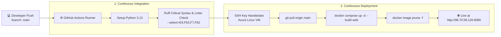

# GaleMed AI — Enterprise Clinical RAG & Knowledge Graph System

<p align="left">
  <a href="#-automated-cicd--cloud-deployment">
    
  </a>
  <a href="#-automated-cicd--cloud-deployment">
    
  </a>
  <a href="#-technology-stack">
    
  </a>
  <a href="#-technology-stack">
    
  </a>
  <a href="#-technology-stack">
    
  </a>
  <a href="#-technology-stack">
    
  </a>
  <a href="#-technology-stack">
    
  </a>
  <a href="#-technology-stack">
    
  </a>
  <a href="#-technology-stack">
    
  </a>
  <a href="#-technology-stack">
    
  </a>
  <a href="#-technology-stack">
    
  </a>
  <a href="#-technology-stack">
    
  </a>
  <a href="#-getting-started">
    
  </a>
</p>

**GaleMed AI** is an advanced, production-grade clinical Decision-Support & Retrieval-Augmented Generation (RAG) system. Designed to navigate vast medical encyclopedias and clinical reference literature (*The Gale Encyclopedia of Medicine*), the platform integrates:
- **Dense Vector Retrieval (Qdrant HNSW)** + **Lexical Keyword Search (BM25)** via Reciprocal Rank Fusion ($k=60$)
- **Knowledge Graph Traversal (Neo4j GraphRAG)** for multi-hop clinical relationship extraction
- **L1 Semantic Caching (Redis Stack)** with cosine similarity matching for sub-10ms query reuse
- **Precision Cross-Encoder Reranking (`ms-marco-MiniLM-L-6-v2`)** with Maximal Marginal Relevance (MMR)
- **Automated RAGAS Evaluation** for clinical quality auditing (Faithfulness, Relevancy, Precision, Recall, Safety)
- **End-to-End LLM Observability via Langfuse** with 6 granular spans, token cost calculation, and PII anonymization

---

## 🏗️ Architecture Overview

The system operates on an authentic **Dual-Pipeline Architecture** separating **Offline Medical Knowledge Ingestion** from **Online Real-Time Clinical Retrieval & Generation**:

<p align="center">
  
</p>

---

## 🌟 Key Features

*   **⚡ L1 Redis Semantic Cache:** Cosine similarity threshold ($\ge 0.92$) • Sub-10ms RAM retrieval • Zero LLM API cost.
*   **🧬 Neo4j GraphRAG:** Multi-hop clinical reasoning • 1,465 entities (Disease, Drug, Symptom) • 441 relationships.
*   **🔍 Hybrid Search & RRF:** Qdrant Vector Index (Top-50) + BM25 Sparse Index (Top-50) • Reciprocal Rank Fusion ($k=60$).
*   **🎯 Cross-Encoder Reranking & MMR:** Re-scoring top candidates with `ms-marco-MiniLM-L-6-v2` • Dynamic MMR ($\lambda=0.8$) to guarantee diversity and coverage.
*   **🔄 Query Transformation:** Hypothetical Document Embeddings (HyDE) • Clinical Query Decomposition • Intent Routing.
*   **🛡️ Medical Safety & Guardrails:** Regex emergency triage • PII masking • Strict zero-hallucination source attribution.
*   **📈 Full-Stack Observability:** Distributed Langfuse tracing (6 spans) • Real-time cost & latency tracking • RAGAS quality drift detection.

---

## 📊 Dataset & Knowledge Graph Statistics

The clinical knowledge base is constructed from verified medical literature (*The Gale Encyclopedia of Medicine*):

<div align="center">

| Metric / Category | Volume | Details |
| :--- | :---: | :--- |
| **Medical Reference Documents** | **292** entries | Disease (107), Drug (54), General (84), Procedure (34), Test (13) |
| **Indexed Vector Chunks** | **13,350** chunks | Semantic-chunked (avg. 164 chars) with normalized embeddings |
| **Vector Store Collection** | `medical_docs` | Qdrant HNSW Index (M=16, ef_construct=200) |
| **Graph Entities (Nodes)** | **1,465** nodes | Disease (288), Medication (333), Symptom (508), Procedure (99), Entry (237) |
| **Graph Relationships (Edges)** | **441** relations | `TREATS`, `HAS_SYMPTOM`, `REQUIRES_PROCEDURE`, `BELONGS_TO` |

</div>

---

## 📊 Clinical Evaluation & RAGAS Benchmark (105 Clinical Queries)

The RAG platform is evaluated end-to-end against a gold-standard benchmark suite (**105 clinical QA pairs** in `Data/benchmarks/medical_benchmark_with_ground_truth.json`) comparing **Naive RAG Baseline** against **Full GaleMed Advanced RAG**.

Full strategic analysis and exam answers are documented in detail in [**`docs/ANSWERS.md`**](docs/ANSWERS.md) and [**`output/report.md`**](output/report.md).

### 🏆 Overall Benchmark Summary (105 Empirical Questions)

| Metric | Naive RAG Baseline | Full GaleMed RAG | Delta (Net Impact) | Description |
| :--- | :---: | :---: | :---: | :--- |
| **Faithfulness** | **0.2843** | **0.6636** | **+0.3794 (+133.5%)** | Clinical claims grounded in reference context; eliminates hallucinations. |
| **Answer Relevancy** | **0.3468** | **0.6884** | **+0.3415 (+98.5%)** | Directness and completeness in answering clinical queries without evasiveness. |
| **Context Precision** | **0.2109** | **0.2107** | **-0.0002 (-0.1%)** | Signal-to-noise ratio in retrieved context chunks. |
| **Context Recall** | **0.2879** | **0.3788** | **+0.0909 (+31.6%)** | Coverage of gold-standard clinical knowledge retrieved. |
| **Medical Safety** | **0.9333** | **0.9333** | **+0.0000** | Strict adherence to emergency escalations and medical disclaimers. |
| **Negative Rejection** | **0.8095** | **0.8190** | **+0.0095 (+1.2%)** | Safe refusal of non-medical queries, out-of-scope prompts, and jailbreaks. |
| **Average Latency** | 908 ms | 3,723 ms | +2,815 ms | Full multi-stage retrieval & graph reasoning pipeline. |
| **Cost / 1k Queries** | ~$0.060 | ~$0.318 | +$0.258 | Total API cost per 1,000 processed queries. |

### 🏥 Faithfulness Breakdown by Clinical Specialty

| Clinical Specialty | Naive RAG | Full GaleMed RAG | Delta | Improvement |
| :--- | :---: | :---: | :---: | :---: |
| 💊 **Pharmacology** | 0.2347 | **0.8085** | **+0.5738** | **+244.5%** |
| 🩺 **Surgery & GI** | 0.1822 | **0.7017** | **+0.5195** | **+285.1%** |
| 🚫 **Out-of-Scope (Non-Medical)** | 0.0600 | **0.4833** | **+0.4233** | **+705.5%** |
| 🫀 **Cardiovascular** | 0.3392 | **0.7519** | **+0.4127** | **+121.7%** |
| 🫁 **Respiratory** | 0.3191 | **0.7034** | **+0.3843** | **+120.4%** |
| 🧠 **Neuro-Psychiatry** | 0.3813 | **0.7267** | **+0.3454** | **+90.6%** |
| 🚑 **Emergency Triage** | 0.5200 | **0.7133** | **+0.1933** | **+37.2%** |
| 🛡️ **Adversarial / Jailbreak** | 0.2200 | **0.2333** | **+0.0133** | **+6.0%** |

### 📈 Visual Comparison Charts
All generated evaluation plots are stored in `output/`:
- **Radar Metric Comparison:** [`output/radar_chart.png`](output/radar_chart.png)
- **Per-Category Faithfulness Bar Chart:** [`output/bar_faithfulness.png`](output/bar_faithfulness.png)
- **Aggregated Metric Delta Bar Chart:** [`output/comparison_metrics.png`](output/comparison_metrics.png)
- **Quality vs Latency vs Cost Tradeoff Bubble Chart:** [`output/tradeoff_quality_cost_latency.png`](output/tradeoff_quality_cost_latency.png)

---

## ⚡ Master Evaluation CLI & Commands

The platform provides a unified CLI suite for evaluation, comparative benchmarking, and automated reporting:

```bash
# 1. Master CLI — Run experiments & generate report + charts:
uv run python main.py --run-experiments --generate-report --limit 15

# 2. Fast smoke test (Mock mode — no API cost):
uv run python main.py --mock --limit 5

# 3. Evaluate a specific architecture:
uv run python evaluate.py --architecture full --limit 10
uv run python evaluate.py --architecture naive --limit 10

# 4. Compare architectures from existing checkpoints:
uv run python compare.py --output output/report.md --charts-dir output

# 5. Run end-to-end Task 4 integration smoke test:
uv run python scripts/test_task4_integration.py
```

---

## 🔭 LLM Observability & Tracing (Langfuse)

The system integrates **Langfuse Distributed Tracing** with 6 granular spans to provide glass-box observability:

```
[User Request]
      │
      ├─► Span 1: RedisCacheLookup        (Cache hit/miss latency, similarity score)
      ├─► Span 2: QueryTransformation     (Decomposition, HyDE generation)
      ├─► Span 3: HybridSearch            (Qdrant Dense + BM25 Sparse latencies)
      ├─► Span 4: Neo4jGraph              (Cypher query execution, entity hops)
      ├─► Span 5: CrossEncoderReranking   (ms-marco re-scoring, MMR filtering)
      └─► Span 6: LLMGeneration           (Token usage, pricing USD, streaming output)
```

- **PII Anonymization:** Medical queries undergo regex-based PII masking (`src/observability/pii_masker.py`) before logging to ensure HIPAA & GDPR compliance.
- **Cost Tracking:** Automated token counting and pricing calculation via `src/observability/cost_calculator.py`.

---

## 🛠️ Technology Stack

| Layer | Technology | Purpose |
| :--- | :--- | :--- |
| **Core LLM & Embeddings** | OpenAI `gpt-4o-mini`, SentenceTransformers `all-MiniLM-L6-v2` | Intent reasoning, query transformation, sentence embeddings, and generation |
| **Evaluation Framework** | **Ragas 0.4+**, Custom Clinical Evaluator | Automated Faithfulness, Relevancy, Precision, Recall, and Safety metrics |
| **Observability & Tracing** | **Langfuse SDK**, Custom Spans, PII Masker | Distributed tracing across 6 pipeline spans, token cost calculation, and privacy |
| **Reranking** | `cross-encoder/ms-marco-MiniLM-L-6-v2` | Post-retrieval cross-attention passage reranking with MMR ($\lambda=0.8$) |
| **Vector Database** | **Qdrant** | High-performance vector storage with HNSW index ($k=50$) |
| **Graph Database** | **Neo4j 5** (APOC enabled) | Multi-hop clinical entity and relation traversal |
| **Semantic Cache** | **Redis Stack** | Sub-10ms vector similarity response cache ($\ge 0.92$) |
| **Lexical Search** | **Rank-BM25** | In-memory exact keyword matching ($k=50$) |
| **Backend API** | **FastAPI**, **Uvicorn** | Asynchronous HTTP API with streaming responses and OpenAPI docs |
| **Frontend UI & Design** | **React**, **Vite**, **Stitch MCP**, Glassmorphic CSS | Modern clinical chat UI, live latency metrics, and citation preview designed via Stitch MCP |
| **Tooling & Protocols** | **MCP (Model Context Protocol)**, Stitch | Standardized agentic protocol for UI design generation and screen iterations |
| **Containerization** | **Docker**, **Docker Compose** | Multi-stage slim runtime build with non-root security |
| **CI/CD & Cloud** | **GitHub Actions**, **Microsoft Azure VM** | Automated syntax/lint validation and automated SSH cloud deployment |

---

## 🔄 Automated CI/CD & Cloud Deployment

The repository includes a production **Continuous Integration / Continuous Deployment (CI/CD)** pipeline powered by GitHub Actions and Microsoft Azure:



---

## 🚀 Quick Start Guide

### Prerequisites
- [Docker & Docker Compose](https://docs.docker.com/get-docker/) installed
- [uv Package Manager](https://docs.astral.sh/uv/) installed
- OpenAI API Key

### 1. Clone & Configure Environment
```bash
git clone https://github.com/BaoNguyenz/End-to-end-Medical-Ai-Chatbox.git
cd End-to-end-Medical-Ai-Chatbox

# Create environment file
cp .env.example .env
```
Open `.env` and set your API keys:
```env
OPENAI_API_KEY=sk-your-openai-api-key
LANGFUSE_PUBLIC_KEY=pk-lf-...
LANGFUSE_SECRET_KEY=sk-lf-...
```

---

### 2. Run with Docker Compose (Recommended)

#### Step A: Start all infrastructure services
```bash
docker compose up -d
```
*Spins up `rag-web` (FastAPI), `rag-qdrant` (Vector DB), `rag-neo4j` (Graph DB), and `rag-redis` (Cache).*

#### Step B: Ingest Knowledge Base & Build Graph
```bash
# 1. Index 13,350 chunks into Qdrant & build BM25 corpus
docker compose run --rm web python scripts/index_documents.py

# 2. Populate Neo4j Knowledge Graph with medical entities
docker compose run --rm web python scripts/build_graph.py

# 3. Restart web server to bind freshly populated databases
docker compose restart web
```

#### Step C: Access Applications
- 🌐 **Web Chat Application:** `http://localhost:8080` (or `http://localhost:8000`)
- 📖 **Interactive API Documentation:** `http://localhost:8080/docs`
- 🩺 **System Health Endpoint:** `http://localhost:8080/api/health`
- 🗄️ **Qdrant Vector Dashboard:** `http://localhost:6335/dashboard`
- 🕸️ **Neo4j Graph Browser:** `http://localhost:7475` (Auth: `neo4j` / `password123`)

---

### 3. Local Development (with `uv`)

```bash
# Create virtual environment & install all dependencies
uv venv
uv pip install -e ".[dev]"

# Start database containers only
docker compose up -d qdrant neo4j redis

# Ingest data & run locally
uv run python scripts/index_documents.py
uv run python scripts/build_graph.py
uv run uvicorn app:app --reload --port 8000
```

---

## 🧪 Testing & Verification Suite

Run automated test suites to verify each layer of the pipeline independently:

```bash
# --- Core Engine Tests ---
uv run python scripts/test_redis_cache.py            # L1 Redis Semantic Cache
uv run python scripts/test_hybrid_search.py          # Vector + BM25 Fusion (RRF)
uv run python scripts/test_query_transformation.py   # HyDE & Query Decomposition
uv run python scripts/test_post_retrieval.py         # Cross-Encoder Reranker & MMR
uv run python scripts/test_graph.py                  # Neo4j Knowledge Graph Traversal

# --- Final Exam Deliverables Tests ---
uv run python scripts/test_ragas_evaluator.py        # Task 1: RAGAS Evaluation Framework
uv run python scripts/test_observability.py          # Task 2: Langfuse Observability & Tracing
uv run python scripts/test_architectures.py          # Task 3: Architecture Comparison & Ablation
uv run python scripts/test_task4_integration.py      # Task 4: Integrated Platform & Deliverables
```

---

## 📄 License & Acknowledgments

This project is licensed under the MIT License. Developed as an Enterprise Medical AI and Production-Ready RAG Evaluation System integrating Hybrid Search, Knowledge Graph reasoning, sub-second caching, and distributed observability.
